# BaseCard Contract Workflow

This document describes the state transitions and validation flows for the BaseCard NFT contract.

## Architecture Overview

---

## CardData Validation Flow

```mermaid
flowchart LR
    subgraph Input["📥 CardData"]
        I1["nickname"]
        I2["imageURI"]
        I3["role"]
        I4["bio"]
    end

    subgraph Validation["✅ _validateCardData()"]
        V1{"nickname == ''?"}
        V2{"imageURI == ''?"}
        V3{"role in allowedRoles?"}
    end

    I1 --> V1
    V1 -->|Yes| E1["❌ EmptyNickname"]
    V1 -->|No| V2

    I2 --> V2
    V2 -->|Yes| E2["❌ EmptyImageURI"]
    V2 -->|No| V3

    I3 --> V3
    V3 -->|No| E3["❌ NotAllowedRole"]
    V3 -->|Yes| OK["✅ Valid"]

    I4 --> OK
```

| Field      | Validation              | Can be empty? |
| ---------- | ----------------------- | ------------- |
| `nickname` | Required                | ❌ No         |
| `imageURI` | Required                | ❌ No         |
| `role`     | Must be in allowedRoles | ❌ No         |
| `bio`      | Optional                | ✅ Yes        |

---

## mintBaseCard Flow

---

## editBaseCard Flow

---

## linkSocial Flow

```mermaid
sequenceDiagram
    participant User
    participant Contract
    participant Storage

    User->>Contract: linkSocial(tokenId, key, value)

    Contract->>Storage: Verify ownerOf(tokenId) == msg.sender
    alt Not Owner
        Contract-->>User: ❌ NotTokenOwner
    end

    Contract->>Storage: Validate _allowedSocialKeys[key]
    alt Not Allowed
        Contract-->>User: ❌ NotAllowedSocialKey
    end

    alt value == ""
        Contract->>Storage: delete _socials[tokenId][key]
        Contract-->>User: 📢 SocialUnlinked
    else value != ""
        Contract->>Storage: _socials[tokenId][key] = value
        Contract-->>User: 📢 SocialLinked
    end
```

---

## Individual Update Functions

| Function           | Validation      | Updates                       |
| ------------------ | --------------- | ----------------------------- |
| `updateNickname()` | Cannot be empty | `_cardData[tokenId].nickname` |
| `updateBio()`      | Allows empty    | `_cardData[tokenId].bio`      |
| `updateImageURI()` | Cannot be empty | `_cardData[tokenId].imageURI` |

> All update functions require `onlyTokenOwner` modifier.

---

## Allowed Roles

| Role        | Description                                           |
| ----------- | ----------------------------------------------------- |
| `Developer` | Build amazing applications and smart contracts        |
| `Designer`  | Create beautiful and user-friendly interfaces         |
| `Marketer`  | Promote and grow communities and products             |
| `Founder`   | Lead and build innovative projects from the ground up |
| `BD`        | Drive partnerships and expand business opportunities  |
| `PM`        | Manage products and coordinate teams to deliver value |

> **Note**: Use `setAllowedRole("NewRole", true)` to add new roles.

---

## Allowed Social Keys

- `x`
- `farcaster`
- `website`
- `github`
- `linkedin`
- `basename`

> **Note**: Use `setAllowedSocialKey("newkey", true)` to add new social platforms.
